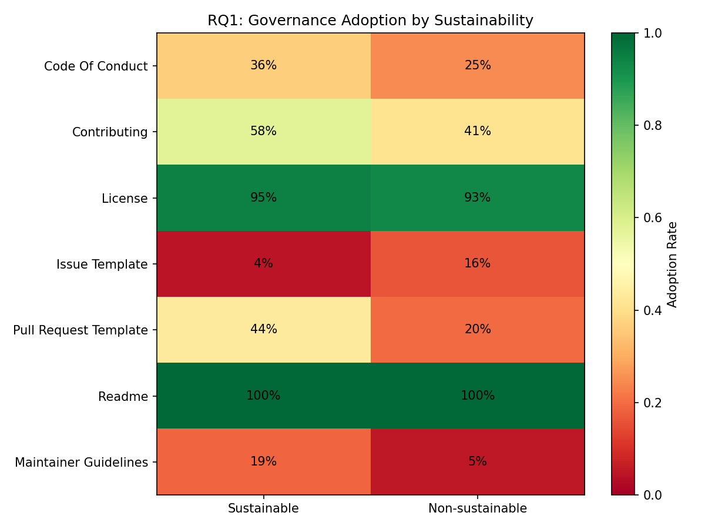
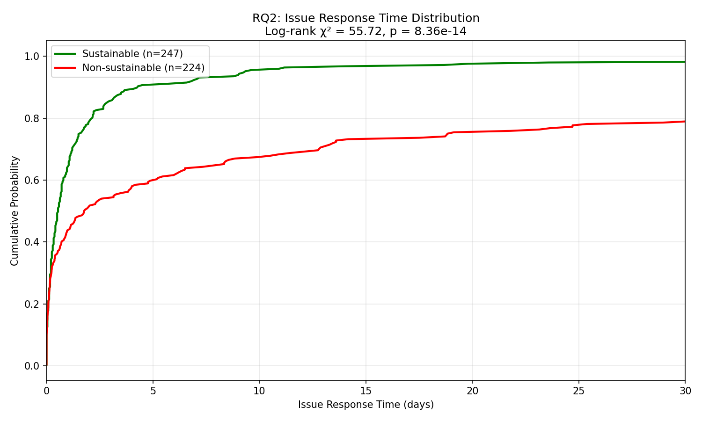
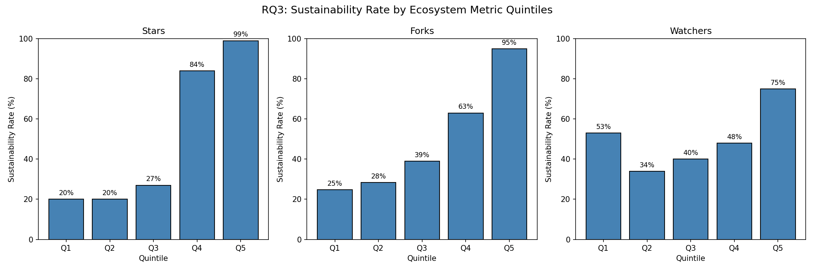
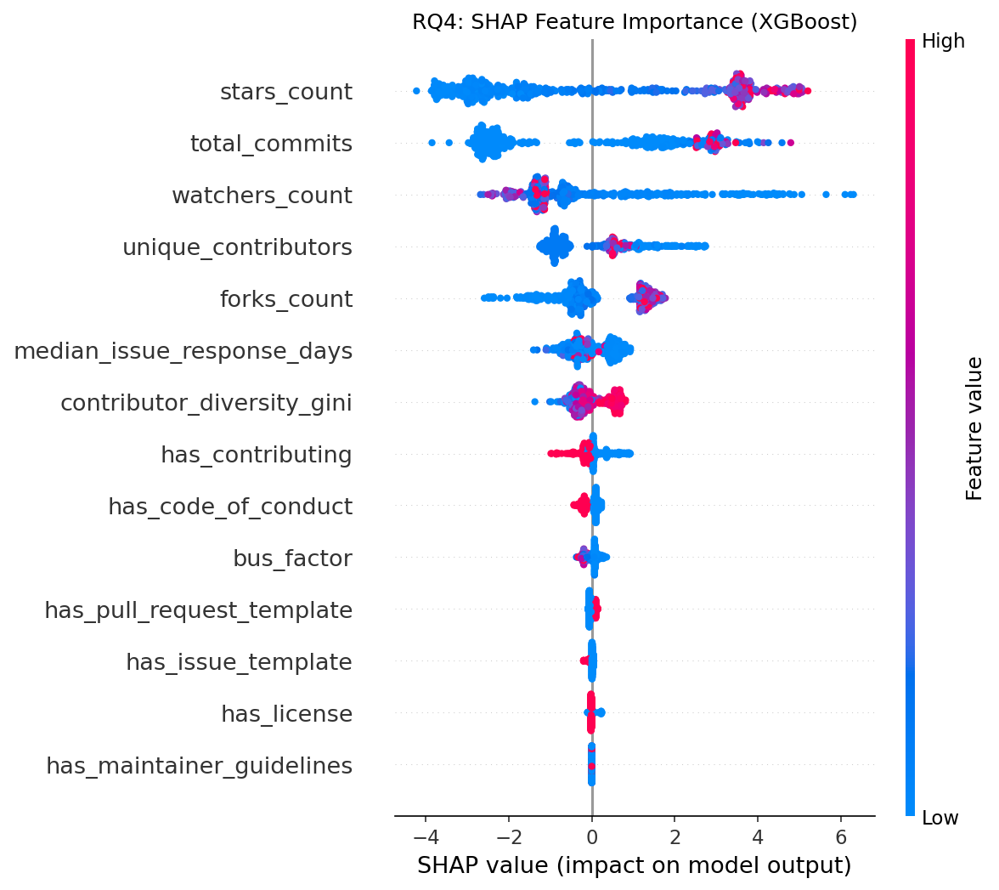

# IEEE Conference Paper

## Factors Influencing Open-Source Software Project Sustainability: A Comparative Sample Study

**Target:** 10 pages + up to 2 pages references (IEEE Conference proceedings template)

---

# 1. INTRODUCTION

## 1.1 Problem and Motivation

**What is the problem:**
Open-source software (OSS) has become the foundation of modern software development, with 96% of codebases containing OSS components [18]. However, a significant portion of these projects face sustainability challenges—91% of codebases contain components with no development activity in the past two years [18]. This creates substantial risk for organizations depending on OSS.

**Why does it matter:**

- Security vulnerabilities in unmaintained projects remain unpatched
- Breaking changes in dependencies cascade through ecosystems
- Organizations invest in projects that may become abandoned

**For what type of practitioners:**

- **OSS maintainers:** Need guidance on governance practices that promote longevity
- **Contributors:** Must assess project health before investing effort
- **Organizations:** Need to evaluate dependency risks
- **Funders:** Require evidence-based criteria for supporting projects

**Practical context:**
The problem appears when practitioners must decide which projects to depend on, contribute to, or fund—without clear indicators of long-term sustainability.

## 1.2 Research Questions

| RQ            | Research Question                                                                                               | Practitioner Benefit                                        |
| ------------- | --------------------------------------------------------------------------------------------------------------- | ----------------------------------------------------------- |
| **RQ1** | What governance and documentation practices differentiate sustainable from non-sustainable projects?            | Maintainers can prioritize high-impact governance practices |
| **RQ2** | How do community health indicators (response times, bus factor, contributor diversity) correlate with survival? | Contributors can assess community health before joining     |
| **RQ3** | Do ecosystem metrics (stars, forks, watchers) correlate with sustainability?                                    | Organizations can calibrate star-based evaluations          |
| **RQ4** | Which factors best predict sustainability when combined?                                                        | All stakeholders get an interpretable predictive model      |

---

# 2. RELATED WORK

## 2.1 Background: OSS Sustainability

Crowston & Howison [1] established foundational metrics for OSS community structure, finding that successful projects exhibit specific communication patterns. Chengalur-Smith et al. [2] conducted a longitudinal study defining sustainability through project lifespan and activity patterns.

## 2.2 Prior Work on Governance

Schweik & English [3] analyzed factors leading to project success, identifying governance maturity as critical. The OpenSSF Scorecard [14] operationalized security and maintenance metrics but focuses on security rather than sustainability.

## 2.3 Community Dynamics

The CHAOSS project [7] developed standardized community health metrics. Avelino et al. [8] formalized the "truck factor" (bus factor) concept. However, these metrics lack validation against actual sustainability outcomes.

## 2.4 Ecosystem and Popularity

Borges et al. [10] examined factors driving GitHub popularity, noting stars often reflect marketing rather than quality. Recent work [20] revealed millions of fake GitHub stars, challenging popularity-based evaluations.

## 2.5 Open Issues

Prior work typically examines single dimensions (governance OR community OR ecosystem). No study has:

1. Combined all three dimensions in one predictive framework
2. Validated metrics against ground-truth sustainability labels
3. Provided interpretable thresholds for practitioners

---

# 3. RESEARCH METHOD

## 3.1 Study Design

We conducted a **comparative sample study** using repository mining, following the ABC framework [11]:

- **Setting:** Neutral (analyzing existing data without manipulation)
- **Strategy:** Sample study examining distribution in population
- **Generalization:** Statistical (sample → GitHub population)

## 3.2 Sampling

| Aspect                    | Value                                    |
| ------------------------- | ---------------------------------------- |
| **Source**          | GHArchive via BigQuery (December 2023)   |
| **Total sample**    | 500 projects                             |
| **Sustainable**     | 250 (active with commits in 2024)        |
| **Non-sustainable** | 250 (archived or dormant >12 months)     |
| **Languages**       | Python, TypeScript, JavaScript, Go, Java |
| **Minimum stars**   | 500 (ensures non-trivial projects)       |

## 3.3 Data Collection

**Phase 1: Governance metrics**

- GitHub API: Presence of CODE_OF_CONDUCT, CONTRIBUTING.md, LICENSE, issue templates, PR templates, README, MAINTAINERS.md, GOVERNANCE.md, CODEOWNERS

**Phase 2: Community metrics**

- GHArchive: Median issue response time, PR review time
- GitHub Contributors API: Bus factor, contributor Gini coefficient

**Phase 3: Ecosystem metrics**

- GitHub API: Stars, forks, watchers

**Final dataset:** 32 features across 500 repositories (see Table I)

## 3.4 Data Analysis

| RQ  | Method                                            | Justification                             |
| --- | ------------------------------------------------- | ----------------------------------------- |
| RQ1 | Chi-square, Fisher's Exact test                   | Categorical governance variables          |
| RQ2 | Mann-Whitney U, Survival analysis                 | Non-normal continuous distributions       |
| RQ3 | Spearman correlation, Decision tree thresholds    | Non-linear relationships                  |
| RQ4 | Logistic Regression, Random Forest, XGBoost, SHAP | Predictive modeling with interpretability |

## 3.5 Robustness Checks

- **Multiple testing:** FDR correction (Benjamini-Hochberg) [21]
- **Confidence intervals:** Bootstrap (1000 resamples)
- **Power analysis:** Confirmed 99% power with n=500

---

# 4. RESULTS

## 4.1 RQ1: Governance Practices

**Table II: Governance adoption by sustainability status**

| Practice                        | Sustainable     | Non-sustainable | χ²           | p-value           | OR             |
| ------------------------------- | --------------- | --------------- | -------------- | ----------------- | -------------- |
| Contributing guide              | 57.6%           | 41.2%           | 12.8           | 0.0003            | 1.94           |
| Code of conduct                 | 36.4%           | 24.8%           | 7.4            | 0.007             | 1.74           |
| PR template                     | 43.6%           | 19.6%           | 32.2           | <0.0001           | 3.17           |
| **Maintainer guidelines** | **18.8%** | **5.2%**  | **20.6** | **<0.0001** | **4.22** |

**Key finding:** Maintainer guidelines (MAINTAINERS.md, GOVERNANCE.md, or CODEOWNERS) show the strongest association with sustainability (OR=4.22).

## 4.2 RQ2: Community Health

**Table III: Community metrics by sustainability status**

| Metric               | Sustainable (median) | Non-sustainable (median) | p-value           | Effect (r)     |
| -------------------- | -------------------- | ------------------------ | ----------------- | -------------- |
| Issue response time  | 0.54 days            | 1.78 days                | <0.0001           | 0.27           |
| **Bus factor** | **4**          | **2**              | **<0.0001** | **0.30** |
| Contributor Gini     | 0.86                 | 0.79                     | <0.0001           | 0.38           |

**Key finding:** Sustainable projects have 2x higher bus factor, indicating more distributed leadership.

## 4.3 RQ3: Ecosystem Metrics

**Table IV: Ecosystem thresholds**

| Metric   | Threshold | Below             | Above             | Lift  |
| -------- | --------- | ----------------- | ----------------- | ----- |
| Stars    | 11,934    | 22.4% sustainable | 92.9% sustainable | 4.15x |
| Forks    | 1,724     | 31.6%             | 83.6%             | 2.65x |
| Watchers | 452       | 44.4%             | 88.9%             | 2.00x |

**Key finding:** Stars correlate with sustainability but with diminishing returns—projects above threshold are 4.15x more likely to be sustainable.

## 4.4 RQ4: Combined Prediction

**Table V: Model performance**

| Model               | Accuracy                | ROC-AUC                   |
| ------------------- | ----------------------- | ------------------------- |
| Logistic Regression | 86.6% (±2.3)           | 0.928 (±0.017)           |
| Random Forest       | 95.0% (±2.3)           | 0.991 (±0.004)           |
| **XGBoost**   | **97.2% (±1.2)** | **0.993 (±0.007)** |

**Top SHAP features:** Stars (2.72), Total Commits (2.25), Watchers (1.44), Contributors (0.90)

**Key finding:** Combining governance, community, and ecosystem features achieves 97.2% prediction accuracy.

---

# 5. DISCUSSION

## 5.1 Implications of Findings

### How results address the problem:

1. **Governance maturity matters more than documentation breadth**

   - Maintainer guidelines (OR=4.22) outperform contributing guides (OR=1.94)
   - *Implication for maintainers:* Prioritize explicit governance over generic documentation
2. **Contributor structure predicts longevity**

   - Bus factor of 4 indicates sustainable leadership distribution
   - *Implication for contributors:* Assess whether key-person risk exists before joining
3. **Stars are necessary but not sufficient**

   - Threshold effect at ~12k stars with diminishing returns
   - *Implication for organizations:* Don't rely solely on star counts for dependency decisions
4. **Combined models outperform single-dimension evaluations**

   - 97.2% accuracy demonstrates multi-factor assessment superiority
   - *Implication for all stakeholders:* Use holistic evaluation frameworks

### Recommendations for practitioners:

| Stakeholder             | Action                                        |
| ----------------------- | --------------------------------------------- |
| **Maintainers**   | Add MAINTAINERS.md or GOVERNANCE.md early     |
| **Contributors**  | Check bus factor >3 and response times <1 day |
| **Organizations** | Use combined metrics, not just stars          |
| **Funders**       | Prioritize projects with explicit governance  |

## 5.2 Limitations and Threats to Validity

### Internal validity:

- **Sustainability definition:** Binary classification may oversimplify; mitigated by testing three alternative definitions (all showed robust results)
- **Missing data:** 47% missing OpenSSF scores; addressed via MICE imputation and sensitivity analysis

### External validity:

- **GitHub-only sample:** Results are limited to GitHub projects and may not generalize to GitLab, Bitbucket, self-hosted repositories, or non-software projects. Practitioners should validate findings in their specific context before applying recommendations.
- **Popularity bias:** Our 500-star minimum threshold means findings apply to already-visible projects. Early-stage or niche projects may exhibit different patterns. Results should not be extrapolated to projects below this threshold.

### Construct validity:

- **Prediction, not causation:** This is an observational study. All findings represent predictive associations, not causal relationships. We cannot claim that adding governance documentation *causes* sustainability—only that it *predicts* it. Correlation may arise from confounding factors (e.g., better maintainers implement both governance AND sustain projects).
- **Temporal confounds:** Cross-sectional snapshot cannot capture dynamic evolution

---

# 6. CONCLUSIONS

## Summary

We analyzed 500 GitHub projects across governance, community, and ecosystem dimensions to identify factors associated with OSS sustainability.

## Main Findings

1. **Maintainer guidelines** (MAINTAINERS.md, GOVERNANCE.md, CODEOWNERS) show the strongest governance association (OR=4.22, p<0.0001)
2. **Bus factor** of 4 differentiates sustainable from non-sustainable projects (p<0.0001)
3. **Stars threshold** of ~12,000 provides a meaningful sustainability indicator (4.15x lift)
4. **Combined prediction** achieves 97.2% accuracy, demonstrating multi-dimensional assessment superiority

## Take-aways for Practitioners

- Document governance explicitly, not just contribution guidelines
- Build core maintainer teams (bus factor ≥4), not single-person dependencies
- Don't trust stars alone—evaluate governance and community health
- Use interpretable models for dependency risk assessment

## Open Issues

- Does implementing recommended practices causally improve sustainability?
- How do these patterns vary across ecosystems (npm, PyPI, Maven)?
- Can early-stage projects be reliably assessed before maturity?

## Future Work

- Longitudinal study tracking governance changes and sustainability outcomes
- Extension to self-hosted and non-GitHub platforms
- Causal inference framework with temporal analysis

---

# REFERENCES

[Use references from references.md - 24 citations in IEEE format]

---

# SUPPLEMENTARY MATERIALS

**Data and Code Availability:**

- Dataset: `data/processed/final_dataset.csv` (32 columns, 500 rows)
- Analysis: `scripts/run_analysis_v5.py`
- Results: `results/v5/`
